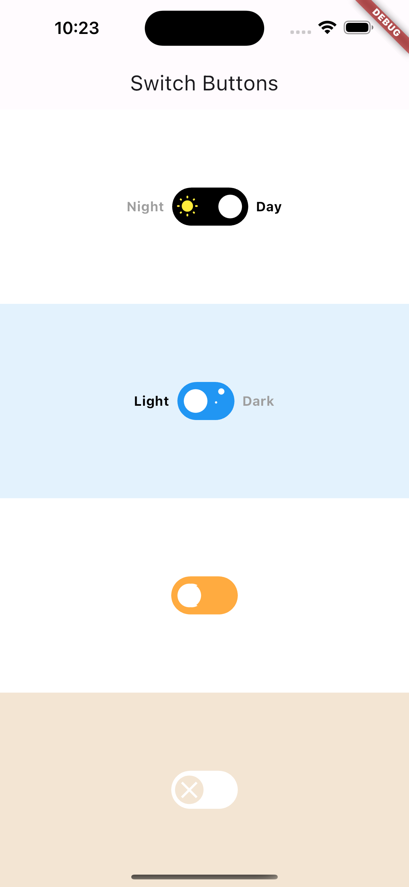

# Flutter Switch Buttons

This Flutter project showcases four different types of Switch Buttons, providing a variety of options for implementing switch functionality in your Flutter applications.

## Features

- **Custom Switch:** A customizable switch button that allows you to modify its appearance and behavior to suit your application's design requirements. 
- **Light/Dark Switch:** A visually appealing switch button that slides smoothly between on and off positions.
- **Day/Night Switch:** An animated switch button with a delightful transition between states.
- **Minimal Switch:** A simple and straightforward switch button with an on/off state.

## Screenshots



## Getting Started

To use these Switch Buttons in your Flutter project, follow these steps:

1. Clone the repository:

   ```shell
   git clone https://github.com/alvaroarmijos/switch_buttons.git

2. Open the project in your preferred Flutter development environment (e.g., Android Studio, VS Code).

3. Build and run the project on your desired device or simulator.

4. Explore the code and customize the Switch Buttons to fit your application's needs.

## Contributing

Contributions are welcome! If you have any ideas, suggestions, or improvements, feel free to open an issue or submit a pull request.

## License
This project is licensed under the MIT License.


Feel free to customize the content according to your specific project and requirements.
